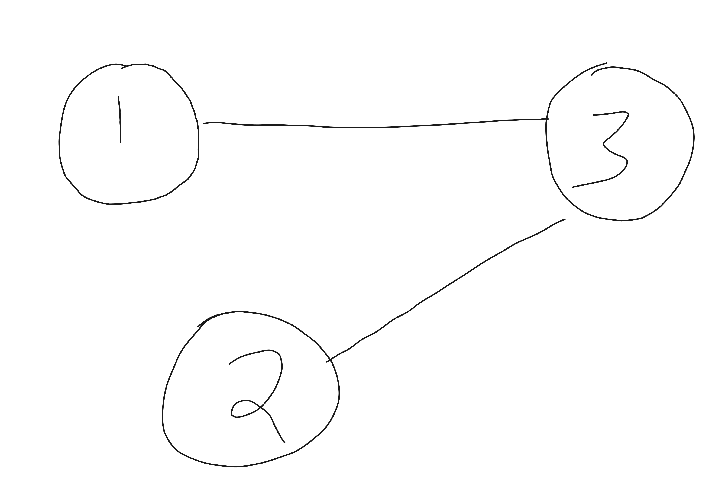

Alek Westover, Anthony Wang, Kevin Zhao

MIT Deep Learning Final Project

"Investigating Off-Distribution Generalization of Transformers"

In this project we hope to further the community's understanding of *when* off-distribution generalization happens. Paul Christiano proposed an experiment [here](https://www.alignmentforum.org/posts/BxersHYN2qcFoonwg/experimentally-evaluating-whether-honesty-generalizes?commentId=dsDA2BWpHPdgLvaXX) to investigate this; our project is essentially to implement Christiano's proposed experiment. To the best of our knowledge no one has done this yet.

## Motivation

It is generally desirable for LLMs to output true statements.
One current approach for ensuring truthfulness of LLM outputs is having
a human in the loop that rewards a model for true outputs (e.g.,
RLHF).
One drawback of this approach is that sometimes humans may be
poor judges of truthfulness.
Humans enjoy many cognitive biases and might employ superficial
heuristics when judging truthfulness.
A further challenge is that as LLMs become more capable, there
might not even exist experts that are good judges of whether the
models outputs are truthful.
For instance, most Task Rabbit workers would probably be hard
pressed to evaluate whether a difficult mathematical proof
produced by an LLM is true. The entire mathematical community has
been known on occasion to believe [false statements for many years](https://en.wikipedia.org/wiki/Grunwald%E2%80%93Wang_theorem).

One approach to solving this problem is to reward an LLM for
truthful behavior on simple inputs, and then hope that the LLM
generalizes to truthful behavior on more complex inputs where
humans are unable to give helpful labels.
Deep learning models often perform remarkable feats of
off-distribution generalization -- for instance, a model trained
to transform hand drawn cats into images of cats might be
able to handle a "cat" with three eyes in an intuitive way.
We might hope that generalizing truthfully is simple, and thus
promoted by "Occam's Razor". We hope that our experiments in this
project can shed light on whether this is likely to happen.

## Plan

We will use a synthetic task to test our hypothesis that models
will generalize truthfully off-distribution. 
The synthetic task is computing the distance between various
vertices in an input graph. Our experiment will have three parts:

1. Pre-train a transformer to predict the distance between two
   fixed vertices $s,t$ on graphs with $n\in [16, 64]$ vertices.
2. Fine-tune a transformer to predict the distances between
   $s,t'$ for any $t'$ which is on the shortest path from $s$ to
   $t$. Only do the fine-tuning on graphs with $n\in [16,32]$
   vertices.
3. Test whether the transformer can accurately predict the
   distances between $s,t'$ for any $t'$ on the shortest path
   from $s$ to $t$ for graphs with $n\in [16,64]$ vertices.

## Data

To represent an $n$ vertex, $m$ edge graph we will use a sequence
$[a_1,b_1,a_2,b_2,\ldots,a_m,b_m] \in \{1,2,\ldots,n\}^{2m}$. We
will use the token $0$ as a padding token and pad all the
sequences to be the same length.
This sequence represents an unweighted, undirected graph on vertex set
$\{1,\ldots,n\}$ with edges $\{(a_i,b_i)\}$.

The full input to our model will have one more token (after
adding the padding tokens), which is the target vertex. The value
that the model is tasked with predicting is the distance between
vertex $1$ and the target vertex $t$. In the case that there is
no path from $1$ to $t$ we set this distance to be one larger
than the maximum possible number of vertices -- this represents
infinity.

So in summary, an input output pair for our model could look like
this:

> Input: [1, 3, 3, 2, 0, 0, 0, 0, 2]. Output: 2

We have three separate datasets.

**Pre-train data**

For each $n\in [16,64]$ we will generate several graphs on $n$
vertices. We generate these graphs by inserting $2n$ random edges into the graph.
We always set the target vertex to be $2$ here.

**Fine-tune data**
For each $n\in [16,32]$ we will generate several graphs on $n$
vertices. We generate these graphs by inserting $2n$ random edges into the graph.
We select the target vertex to be a random vertex on the shortest
path from $1$ to $2$.

**Generalization testing data**
The same as the fine-tune data, except we sample $n\in [32,64]$
instead.

As a side note, we're also curious whether the transformer
learns to generalize to different distributions of graphs, e.g.,
denser graphs or graphs with different properties. Time
permitting we'll investigate this as well.

## Architecture

We plan to use a standard transformer architecture. We will
ensure that the number of layers in our transformer is at least
the diameter of the graph. By doing this, we ensure that there is
an extremely simple circuit --- namely BFS --- that the transformer
could in theory learn to perform the task.
Note that if the transformer actually learns a simple circuit to
perform this task, then it seems more likely to generalize well.
This is also our intuition for why it should be possible to fine
tune on a small amount of data for finding shortest paths to
other vertices besides $2$ -- it seems like the model should be
computing these other distances as intermediate values in its
computation to find the distance to vertex $2$.

## Positional Encodings 

In order to facilitate performing this task with limited
computational resources, we plan to use custom-made positional
encodings that tell the model extra information about the
structure of the problem, rather than the traditional sine/cosine
positional encodings (although we're open to experimenting to see
if our custom positional encodings actually are any better than
the sine/cosine positional encodings).
Specifically, our positional encodings will be
$v_1,v_1,v_2,v_2,\ldots,v_m,v_m,v_{m+1}$ where these are all
random independent vectors.
We will concatenate these with the token encodings rather than
adding them.
This should let the model easily have large attention scores between
vertices corresponding to a single edge. 

