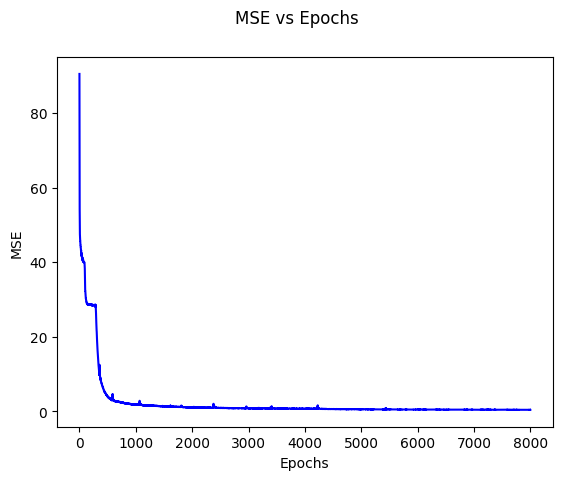
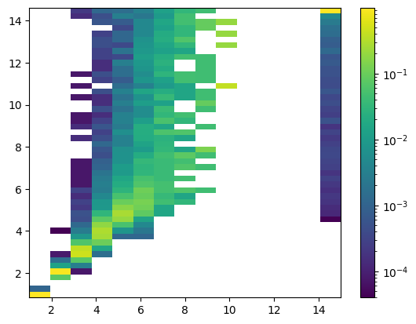
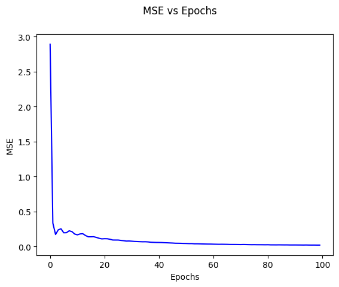
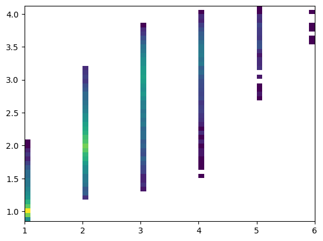
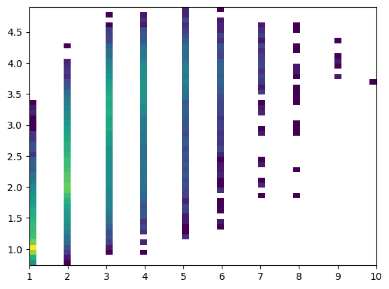

<!-- Guidelines: https://www.dropbox.com/scl/fi/bet8enscln8ue36kd8t17/final_project_guidelines.pdf?rlkey=knd19cnumk51ho1y9crno56ib&e=2&dl=0 -->

Anthony Wang, Alek Westover, Kevin Zhao

{xy,alekw,kevinmz}\@mit.edu

## Abstract

TODO

## Introduction

### Overview

Recently, LLMs have been developing very fast, and with that comes the concern of aligning the models to output true and productive statements. One common approach for ensuring this is to have a human in the loop rewarding the model for true outputs (e.g. RLHF), but one drawback to this problem is that humans can be poor judges of truthfulness. As LLMs become more capable, there might not even exist experts that are good judges of whether the model's outputs, such as difficult mathematical proofs, are truthful. So, we'd like to propose a potential solution to this issue via **off-distribution generalization** - applying human-like intuition to solve problems not in the dataset. Paul Christiano [proposed an experiment](https://www.alignmentforum.org/posts/BxersHYN2qcFoonwg/experimentally-evaluating-whether-honesty-generalizes?commentId=dsDA2BWpHPdgLvaXX) about shortest paths in a graph; our project is essentially to implement Christiano's proposed experiment. To the best of our knowledge, although there has been research in applying machine learning for different variations of graph searches [@10.5555/3666122.3666260], no one has done our exact experiment yet.

It is generally desirable for LLMs to output true statements. A current approach for ensuring this is to have a human in the loop rewarding the model for true outputs (e.g. RLHF); however, humans can be poor judges of truthfulness. We enjoy many cognitive biases and might employ superficial heuristics when judging truthfulness. A further challenge is that as LLMs develop further, there might not even exist experts that can correctly judge the accuracy and truthfulness of sophisticated outputs such as difficult mathematical proofs.

One approach to solving this problem is to reward an LLM for truthful behavior on simple inputs, and then hoping that the LLM generalizes its truthful behavior for more complex inputs where humans cannot provide helpful labels. Deep learning models often perform remarkable feats of off-distribution generalization -- for instance, a model trained to transform hand drawn cats into images of cats might be able to handle a "cat" with three eyes in an intuitive way. We might hope that generalizing truthfully is simple, thus promoted by "Occam's Razor", and aim to investigate that with this project.

COMMENT FROM KEVIN -- synthesize from intorduction

## Task

We will use a synthetic task to test our hypothesis that models will generalize truthfully off-distribution. The synthetic task is computing the distance between various vertices in an input graph. Our experiment will have three parts:

1. Pre-train a transformer to predict the distance between two fixed vertices $s,t$ on graphs with $n\in [8, 32)$ vertices.
2. Fine-tune a transformer to predict the distances between $s,t'$ for any $t'$ which is on the shortest path from $s$ to $t$, but only do fine-tuning on graphs with $n\in [8,16)$ vertices.
3. Test whether the transformer can accurately predict the distances between $s,t'$ for any $t'$ on the shortest path from $s$ to $t$ for graphs with $n\in [16,32)$ vertices.

## Related Work

COMMENT FROM ALEK 
-- please remove all mentions of graph neural networks -- that is BS: there is no actual reason why you'd ever use a Neural network to solve shortest paths, the point of choosing a synthetic task is because there is a **simple ground truth** which makes it easy to evaluate whether or not our model is performing correctly. We'd also hoped that the simplicity of the task would make it more feasible to do with a limited compute budget, but apparently this task was too hard for our architecture.

There has been some research into the algorithmic optimization of GNNs and how they may solve real-world issues; however, none of the related work targets using generic machine learning methods to solve graph problems.

- Cappart et al. has researched more into the Combinatorial Optimization of GNNs and developed algorithms for related tasks, thus facilitating machine learning [@DBLP:journals/corr/abs-2102-09544]. Their results are mostly algorithmic so we develop further by trading a bit of accuracy for much faster computation in such tasks.

- Tutsoy uses a graph-theory-based approach to model the epidemiological characteristics of infectious diseases, such as COVID-19 [@10.1109/TPAMI.2023.3256421]. We understand from his paper how GNN optimization may also be useful in researching novel diseases.

### Theory

### Algorithm for Shortest Paths

The standard algorithm to find the shortest path in a graph between a source numbered as $u$ and sink numbered as $v$ is **breadth-first search (BFS)**. The BFS algorithm maintains a mapping of visited vertices to their distances with respect to $u$, and each run of the algorithm goes through all the vertices newly visited in the previous run, and for each vertex, visits any of its unvisited neighbors. The algorithm terminates once either $v$ is visited or the set of newly visited vertices in a single run is empty.

We will use this algorithm to verify the accuracy of our machine learning approach. Given $V$ vertices and $E$ edges, the runtime of this algorithm is thus $O(V + E)$; however, a machine learning approach may do better in time through parallelism, although at the expense of using much more memory.

### Potential Mathematical Approaches to Shortest Paths

Another way one can think of the shortest path of a graph is using a *matrix* to record which vertices are connected. Given vertices numbered $1$ to $V$, we denote the **adjacency matrix** $\textbf{M}$ of dimensions $V \times V$ as the matrix with element $\textbf{M}_{i, j} = 1$ if vertices $i$ and $j$ are connected by an edge and $\textbf{M}_{i, j} = 0$ if they are not. Now, we note that (1) For all $k$, $(\textbf{M}+I)^k_{i, j} = 0$ if and only if there exists no path from the vertex numbered $i$ to the vertex numbered $j$ that is distance $k$ or less due to Markov matrix processes. As a result, if the distance between vertices numbered $i$ and $j$ is $d$, then $\text{min}\left((\textbf{M}+I)^k_{i, j}, 1\right) = 1$ if $k \ge d$ and $\text{min}\left((\textbf{M}+I)^k_{i, j}, 1\right) = 0$ if $k < d$. 

With this information, because the distance between any two vertices is at most $V-1$ in a graph with $V$ vertices, we note that the *distance* matrix turns out to be simply $$\textbf{D} = \textbf{1}_{V \times V} \cdot V - \Sigma_{i=0}^{V-1}\text{min}\left((\textbf{M}+I)^k_{i, j}, 1\right).$$ The runtime to compute this is $O(V)$, although it will take more space to compute all powers of $\textbf{M}$.

## Our Machine Learning Approach 

### Data

We will represent an $n$ vertex, $m$ edge unweighted, undirected graph as sequence of the endpoints of the $m$ edges, so $[a_1,b_1,a_2,b_2,\ldots,a_m,b_m]$ represents a graph with the edges $\{(a_i,b_i)\}$ for $1 \leq i \leq m$. We will pad all sequences to be the same length using the padding token 0.

The full input to our model will additionally add the target vertex after the padding tokens. The model is tasked with predicting the length of the shortest path between vertex 1 and the target vertex $t$. If no such path exists, we define the length to be $n+1$ which represents infinity. For example, an input-output pair for our model could look like $[1, 3, 3, 2, 0, 0, 0, 0, 2]$ and $2$ respectively.

We have three separate datasets.

- **Pre-train data**: For each $n \in [8,32)$, we will generate several graphs on $n$ vertices. We generate these graphs by inserting $2n$ random edges into the graph. We always set the target vertex to be $2$ here.
- **Fine-tune data**: For each $n \in [8,16)$, we will generate several graphs on $n$ vertices. We generate these graphs by inserting $2n$ random edges into the graph. We select the target vertex to be a random vertex on the shortest path from $1$ to $2$.
- **Generalization testing data**: The same as the fine-tune data, except we sample $n \in [16,32)$ instead.

As a side note, we are also curious whether the transformer learns to generalize to different distributions of graphs, such as denser graphs or graphs with different properties. Time permitting, we will also investigate this.

### Architecture

We plan to use a standard transformer architecture. We will ensure that the number of layers in our transformer is at least the diameter of the graph. By doing this, we ensure that there is an extremely simple circuit --- namely BFS --- that the transformer could in theory learn to perform the task. Note that if the transformer actually learns a simple circuit to perform this task, then it seems more likely to generalize well. This is also our intuition for why it should be possible to fine tune on a small amount of data for finding shortest paths to other vertices besides $2$ -- it seems like the model should be computing these other distances as intermediate values in its computation to find the distance to vertex $2$.

### Embeddings

TODO: fix this

In order to facilitate performing this task with limited computational resources, we plan to use custom-made positional encodings that tell the model extra information about the
structure of the problem, rather than the traditional sine/cosine positional encodings. (TODO: THIS IS OUTDATED) Specifically, our positional encodings are $v_1,v_1,v_2,v_2,\ldots,v_m,v_m,v_{m+1}$ where each $v_i$ is a random vector so each $v_i,v_j$ pair is nearly orthogonal with high probability. We will concatenate these with the token encodings rather than adding them. This should let the model easily have large attention scores between vertices corresponding to a single edge.

### Explicit transformer formula for shortest paths

## Results

### Initial Results

We used a model dimension of 64, four layers, and two heads per layer. We used MSE loss, the Adam optimizer, a learning rate of 8e-4, and a batch size of 131,072 for 8000 unique randomly generated batches. Our final MSE loss was 0.35546875.

### Fine Tuning

After receiving our initial results, we fine-tuned with a learning rate of 1e-5, also with MSE and the same batch size. Our final results are shown below.

## References
