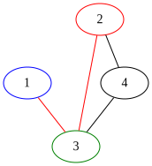
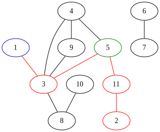
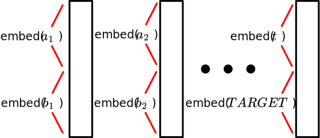

<style>
body {
    /* Shrink margins */
    max-width: 45em;
    /* font-size: 110%; */
}

/* Make sure toolbar plots aren't cut off */
.mpld3-figure {
    height: 480px;
    display: block;
    margin: auto;
}
</style>

<!--
BTW we should run a spell checker on this at some point before submitting 
note to self
-->
<!-- Guidelines: https://www.dropbox.com/scl/fi/bet8enscln8ue36kd8t17/final_project_guidelines.pdf?rlkey=knd19cnumk51ho1y9crno56ib&e=2&dl=0 -->

<div style="text-align:center">
Anthony Wang, Alek Westover, Kevin Zhao

{xy,alekw,kevinmz}\@mit.edu
</div>

## Introduction

### Motivation

Neural networks are capable of impressive feats of off-distribution generalization. For instance, a program trained to convert sketches of cats into realistic looking pictures of cats can draw a cat with three eyes, if the sketch has three eyes, even if such an image never occured in its training data. However, neural networks also often learn non-robust features that cause it to perform very poorly off-distribution (e.g., adversarial examples for an image classifier). In this project, we will investigate the question of when transformers generalize off-distribution through via a case study on a simple synthetic task. More specifically, the goal of our project is to make progress towards answering the following question:

> Suppose you train a model to be truthful on task A, and to produce coherent answers on a related task B.\
> Will the model learn to be truthful on task B?

Here's a more specific version of this question, 
inspired by a [blog post written by Paul Chrisiano](https://www.alignmentforum.org/posts/BxersHYN2qcFoonwg/experimentally-evaluating-whether-honesty-generalizes?commentId=dsDA2BWpHPdgLvaXX) 
(who was influential in developing RLHF).

> Suppose we trained a language model on next token prediction in both English and French, and then fine-tuned the model to be truthful in English. Would the model then learn to answer questions truthfully in French? It has been shown [^1] that this doesn't happen by default, but you could hope that the truthfulness training in English would generalize to French.

In the future, humans are likely to trust AIs with performing important and complex tasks. For some of these tasks it will be infeasible for humans to audit the answers -- either because human labor is too expensive, or because the AIs are too competent, so humans aren't skilled enough to perform an audit (for example, an amateur chess player might have a hard time telling apart a good chess move and a bad chess move). However, there will be some simpler tasks where we can audit the AI's and reward truthul answers. So, it's plausible that models trained to be truthful in some simple domains will learn truthfulness as a general lesson.

### Task

In order to investigate generalization of this type in transformers, we decided to focus on a simple synthetic task -- shortest paths in a graph. More specifically, we ran the following experiment (see [Data](#data) for more details):

1. **Pre-train** a transformer to predict the distance between vertices $1$ and $2$ in graphs with $n \in [3,15]$ vertices.

<div style="text-align:center">

</div>

2. **Fine-tune** a transformer to predict the distances between vertex $1$ to $t$ for any $t$ on the shortest path from $1$ to $2$, but only do fine-tuning on small graphs with $n \in [3,7]$ vertices. Our intuition was that, in training a model to find distances between vertices $1$ and $2$, the model would also implicitly need to learn about distances from vertex $1$ to other vertices on this shortest path.

<div style="text-align:center">

</div>

3. **Test** whether the transformer can accurately generalize to predicting the distance between $1$ to $t$ for any $t \in [3,15]$ on the shortest path from $1$ to $2$ for graphs with $n \in [3,15]$ vertices.

<div style="text-align:center">

</div>

<!--  -->

Obviously, if you actually want to compute shortest paths in a graph, you should use the standard graph algorithm BFS (breadth-first search). Our motivation for using this problem to study generalization was two-fold:

1. It's very simple to generate data and ground truth labels for this task.
2. There is a simple circuit which computes shortest paths (exactly), by doing something akin to BFS. In fact, we implemented this simple circuit by hand in the section [Handcrafted BFS Transformer](#handcrafted-bfs-transformer). Our hope was that our model can also find a simple circuit that generalized well.


<!--
ANT:  
RE t<7
The model couuld've decided to generalize for t > 7 too, but it didn't  
so id say 
we tested generalization for all t in 3, 15
it succeeded for t in 3,7
failed for t in 8 to 15
reason is because it could do "if statements" instead of realizing that it should just be looking at the dor product
mmm
i feel like the fact that it works for 3,7 and not 8,15 is kind of compelling
anyways this  is just a comment explaining how im going to / think you should pitch the generalization section
(it couldve generalized all the way, but didnt, so what we learened is generalization sometimes happens but sometimes doesnt

yeah that's the intuition
can't really do interpretability to figure out if that's actually what's going on
-->

### Findings

Our main findings were as follows:

1. There exists a simple set of weights that you can find by hand to achieve arbitrarily small MSE loss on shortest paths. Moreover, this set of weights is "robust" in the sense that, if you perturb some of these weights and run gradient descent, the model will recover low loss.

2. Transformers can learn on their own to perform shortest paths. The training process consists of a sequence of **phase changes** where the loss would barely change for a large number of epochs, and then over a very small number of epochs, the loss would dramatically go down. (TODO: Is this just because we're bad at DL? now it shouldn't have as many phase changes. Or maybe just in the beginning?) In particular, these phase changes corresponded to times when the model decided to, e.g., go from dramatically over-classifying paths as being length 1 (resulting in great performance on tasks of length 1 but poor performance on other tasks) to spreading these length 1 guesses out to other distances. 

3. A model trained to compute the distance between two specific vertices can be fine-tuned efficiently to compute the shortest distance to other vertices.

4. A model trained to compute the distance between vertices $1$ and $2$ on large graphs, and fine tuned to compute the distance between vertices 1 and any vertex (on a shortest $1$-$2$ path) in small graphs, has the following generalization properties:
   - In larger graphs, the model can still compute the shortest distance between $1$ and any $t$ whose label existed in the smaller graphs, namely $t \in [3,7]$.
   - However, the model fails when the target vertex doesn't exist in smaller graphs.

The main conceptual implication of this work is that, while off-distribution generalization sometimes does occur, sometimes it also doesn't, and it seems tricky to predict when off-distribution generalization will happen.

### Post Outline

The remainder of our post is structured as follows:

1. [Handcrafted BFS Transformer](#handcrafted-bfs-transformer): To start, we explicitly construct by hand weights for a transformer to solve the shortest paths problem. We also investigate the "robustness" of our construction by showing that, starting from our constructed solution it's possible to recover low loss after perturbing the weights via gradient descent. This gives a proof-of-concept that a transformer could encode a simple generalizable solution to the problem, and gives some reason to believe that a transformer could learn such a solution.

2. [Training](#training): Next, we discuss the training. First we describe the exact data generation process and model architecture. Then we discuss hyperparameter settings and optimization choices that were important to get the model to train efficiently. Finally, we investigate some interesting phenomena that occured during training, such as phase transitions in loss for different path lengths.

3. [Generalization](#generalization): Finally we discuss the phenomena that we wanted to study -- generalization! We show that some generalization does occur, but other generalization doesn't. We explain why we think this happens.

## Handcrafted BFS Transformer

In this section we describe an explicit set of weights, made (with love) by hand, that result in a transformer that achieves MSE less than $10^{-6}$ for the shortest paths problem. We'll start by describing the (somewhat involved) constructions, and then investigate the geometry of the loss landscape near our explicit solution. The main reason for doing this is to demonstrate the existence of a simple transformer computing shortest paths, to give proof-of-concept that the transformer could learn a generalizable solution. 

The construction is somewhat tricky to write down, so we'll make several (non-essential) simplifying assumptions:

1. We only care about finding the distance between vertex 1 and vertex 2.
2. We are given a nice embedding of the graph.

It will be obvious from the construction how to get rid of assumptions (1) and (2). 

The embedding of the graph that we will work with here will be different from the embeddings that we use in the rest of the post. In particular, in this section only the tokens will correspond to vertices. In the remainder of the post tokens will correspond to edges. 

More specifically, we will create the following embeddings for our input sequence:

|                 | Answer token | $v_{1}$ token | $\ldots$ | $v_n$ token |
| --------------- | ------------ | ------------- | -------- | ----------- |
| Answer flag     | 1            | 0             |          | 0           |
| Neighbors       |              | 01101         |          | 10010       |
| Reach           |              | 01101         |          | 10010       |
| Out             | 00000        |               |          |             |
| Self            |              | 10000         |          | 00001       |
| Not-answer flag | 0            | 1             |          | 1           |

As you can see, the hidden dimension of the model will be $4n+2$. The hidden dimension is broken up into 5 sections, some of which are only used in the answer token, and some of which are only used in the vertex tokens. Here are what the different parts of the hidden dimension represent:

1. Flags: booleans indicating whether a vertex is the answer token or not. If desired, you can think of this as part of a "positional embedding". The flags will not be updated as we move through the transformer.
2. Neighbors: a boolean vector (of dimension $n$) describing the neighbors of each vertex. (We just put zeros here for the answer token). This also won't update through the course of running the transformer.
3. Reach: a boolean vector representing the vertices that each vertex can reach. This will update over the course of a forward pass of the transformer. Specifically, at layer $i$ of the transformer we will extend the reach of each vertex from vertices which are distance $i+1$ away, to vertices at distance $i+2$ away.
4. Out: this starts as zero for all tokens. Once vertex $1$ can reach vertex $2$ (i.e., we are in a layer deep enough that the reach vector for $v_{1}$'s token indicates that it can reach vertex $2$) we'll start writing $1$ on the answer token's out part of its embedding.
5. Self: a 1-hot encoding specifying which vertex each token corresponds to. You should think of this as a positional embedding (along with the flags).

The transformer will consist of $n$ layers, each of which has $n+1$ heads. We've included the code for the handcoded transformer in the [Appendix](#appendix) -- possibly it's helpful to look at the code in conjunction with the written explanation below.

In layer $i$, our goal is to extend the reach of each vertex $v$ from the set of vertices at distance $i+1$ from $v$ to the set of vertices at distance $i+2$ from $v$. 
The $j$-th head will perform the following operation: 

```
In head j at layer i:
Vertex v's query vector will have high dot-product with vertex w's key vector
iff vertex v can reach vertex j, and vertex w is neighbors with vertex j 

The value that vertex w would give to vertex v is simply a 1-hot vector, with a 1 in the w-th position
```

After running the heads, each vertex's embedding is updated to integrate the new vertices that it can reach into its embedding. Note that we can think of embeddings as being updated because transformers have a residual stream of embeddings that we make modifications to. 

Finally, the last head will be in charge of noticing whether vertex 1 has reached vertex 2 yet, and if so recording this fact. For the full details, see [appendix](#appendix).

### Robustness

The field of Singular Learning Theory (SLT; see Liam Carroll's Master's thesis "Phase Transitions in Neural Networks" for an introduction) aims to understand model training and loss-landscape geometry. In efforts to better understand the loss landscape of the shortest paths loss function according to the tokens used in our hand coded implementation of the shortest paths transformers, we decided to start at a good setting of the parameters, and then perturb the weights, and see if the model can subsequently achieve low loss. The intuition for why this is a good approach at measuring "how attractive of a loss basin" we have is that this experiment is similar to the Local Learning Coefficient from SLT. (see Lau, Edmund, Zach Furman, George Wang, Daniel Murfet, and Susan Wei. "The Local Learning Coefficient: A Singularity-Aware Complexity Measure"). We found that, perturbing the weights led to high loss, but gradient descent was able to recover low loss, indicating that the solution is somewhat "findable" by gradient descent.


TODO: Switch to fancy mpld3 plots


## Training

### Data

We'll represent an $n$ vertex, $m$ edge unweighted, undirected graph as sequence of the endpoints of the $m$ edges, so $[a_1,b_1,a_2,b_2,\ldots,a_m,b_m]$ represents a graph with the edges $\{(a_i,b_i)\}$ where $a_i < b_i$ for $1 \leq i \leq m$. All sequences are padded to the same length using the padding token $0$.

The full input to our model additionally includes the target vertex $t$ after the padding tokens. The label to an input is the length of the shortest path from $1$ to $t$. If no such path exists, we define the length to be $n+1$ which represents infinity. For example, the input $[1, 3, 3, 4, 2, 4, 2, 3, 0, 0, 0, 0, 3]$ has the label $2$.

<div style="text-align:center">

</div>

We have a dataset for each step.

1. **Pre-train data**: For each $n \in [3,15]$, we generated an equal number of graphs on $n$ vertices, with $t = 2$. Each graph was created by choosing $n$ random edges. To balance the dataset, we removed some graphs with shorter paths to obtain the distribution shown below.

TODO: Add axes titles, switch to bar plot

$include`raw="html"` plots/train-dist.html

2. **Fine-tune data**: For each $n \in [3,7]$, we generated an equal number of graphs on $n$ vertices each with a random $t$ on the shortest path from $1$ to $2$. Again, each graph was created by choosing $n$ random edges.

3. **Generalization test data**: The same as the fine-tune data, except we sample $n \in [3,15]$ and $t \leq 7$.

We wrote some Python code to generate the data during the training loop, but Python is excruciatingly slow and data generation wasted a lot of training time. Our solution was to pre-generate the data before training using a multithreaded version of our Python code.

### Architecture


We used a standard transformer architecture. To ensure that it can in theory learn BFS, we ensured that the number of layers in our transformer exceeds the diameter of the input graphs.

Since the order of the edges in the input doesn't matter, we did not use positional encodings. Each edge $(a,b)$ is embedded to dimension $d$ where the first $\frac{d}{2}$ elements are the learned embedding of $a$ and the last $\frac{d}{2}$ elements are the learned embedding of $b$. For the target vertex $t$, we pair it with the special token $TARGET$ and embed $(t,TARGET)$ in the same way.

<!-- https://cocreate.csail.mit.edu/r/sxArTEXiAgJshznmm -->


### Specifications

For our training run, we used the following specifications:

| Hyperparameter           | Value           |
| ------------------------ | --------------- |
| Model dimension          | $64$            |
| Layers                   | $11$            |
| Heads                    | $2$             |
| Epochs                   | $100$           |
| Batch size               | $2^{15}$        |
| Dropout                  | $0$             |
| Training examples        | $10^8$          |
| Parameters               | $550433$        |
| Learning rate            | $5\cdot10^{-4}$ |
| Loss                     | MSE             |
| Optimizer                | Adam            |

The number of bits required to store the model parameters in float32 is around $1.76\cdot10^6$. The number of possible graphs on 15 vertices generated using our procedure is approximately
$$\frac{\binom{15}{2}^{15}}{15!} \approx 1.59\cdot10^{18}.$$
This is because there are $\binom{15}{2}$ choices for each of the 15 edges and we don't care about the order of the edges. This is only an approximation because some edges might be duplicated. Each graph has an answer between 1 and 15 which requires around 4 bits, so memorizing all the answers requires requires $4\cdot1.59\cdot10^{18} = 6.36\cdot10^{18}$ bits, which is $3.61\cdot10^{12}$ times larger than our model size. This implies that in order to get really low loss, our model needs to do something other than brute memorization.

A single training run takes roughly eight hours to run on a Radeon 7900 XTX graphics card.

One pitfall we encountered during training is that we initially used bfloat16 to save VRAM, but our huge batch size caused loss-of-precision problems and made training very difficult. It took us two weeks to debug this until we found that switching to float32 improved training significantly.

### Training Results

Here is our training loss curve:

$include`raw="html"` plots/train-loss.html

Here is a "confusion matrix"-like plot, showing for each true label, the probability distribution over classifications that the model gives.

$include`raw="html"` plots/train-hist.html

One pattern we consistently noticed during training is that the model often gets stuck and plateaus for many epochs before rapidly decreasing. For instance, this happened between epochs 100 and 300 in the graph above:

$include`raw="html"` plots/grokking.html

Such **phase change** phenomena are ubiquitous in deep learning and for simple algorithmic tasks we can sometimes interpret them [^2].

**TODO ANT: training curves for 1, 2, 3 length paths. and add some text about why this is an interesting finding.**

$include`raw="html"` plots/len-loss.html

## Generalization

### Fine Tuning Results

After receiving our initial results, we fine-tuned with a learning rate of 1e-5, also with MSE and the same batch size. Our final results are shown in the images below.

$include`raw="html"` plots/tune-loss.html

$include`raw="html"` plots/tune-hist.html

$include`raw="html"` plots/test-onpath-largetarget.html

$include`raw="html"` plots/test-onpath-smalltarget.html

$include`raw="html"` plots/test-small-any.html

$include`raw="html"` plots/test-large-any.html


## Conclusion

In this post we've investigated solving the shortest paths problem with a transformer. 
We've shown that this problem has a simple solution that can be implemented by a transformer. 
We've shown that a transformer can learn to solve this problem. 
We've shown that when the transformer learns to solve this problem it also implicitly builds good internal representations of the input data that allow for efficient fine tuning to find shortest paths between other vertices. Finally, we've seen that some off-distribution generalization does occur, and some does not! The main conceptual take-away from our work is that it's hard to predict when models will and won't generalize. 

## Appendix

```python
import torch
import torch.nn as nn
import random
from collections import deque

# Configuration
NVTXS = 8
MAXDIST = NVTXS + 1
AVGDEG = 2
SEQLEN = NVTXS + 1
HIDDENDIM = 4 * NVTXS + 2
START_REACH = NVTXS + 1
START_OUT = 2 * NVTXS + 1
START_SELF = 3 * NVTXS + 1
SRC_FLAG_IDX = START_SELF
ANS_FLAG_IDX = 0
NOTANS_FLAG_IDX = -1

# Determine device
device = torch.device("cuda" if torch.cuda.is_available() else "cpu")

def random_graph(device):
    """Generate a random graph tensor."""
    data = torch.zeros((SEQLEN, HIDDENDIM), device=device)
    
    # Mark self vertices
    for i in range(1, NVTXS + 1):
        data[i, START_SELF - 1 + i] = 1

    # Create adjacency list
    adj_list = [set() for _ in range(SEQLEN)]
    indices = [random.randint(1, NVTXS) for _ in range(AVGDEG * NVTXS)]
    
    for i in range(0, len(indices), 2):
        u = indices[i]
        v = indices[i + 1]
        if u != v:
            # Bidirectional connections
            data[v, u] = 1
            data[u, v] = 1
            data[v, NVTXS + u] = 1
            data[u, NVTXS + v] = 1
            adj_list[u].add(v)
            adj_list[v].add(u)

    # Set flags
    data[0, ANS_FLAG_IDX] = 1
    data[1:, NOTANS_FLAG_IDX] = 1
    data[0, START_REACH:START_REACH + NVTXS] = 1
    return data, adj_list

def SSSP(G):
    """Single Source Shortest Path algorithm."""
    dist = [MAXDIST for _ in G]
    dist[1] = 0
    frontier = deque([1])
    while frontier:
        vtx = frontier.popleft()
        for x in G[vtx]:
            if dist[x] == MAXDIST:
                dist[x] = 1 + dist[vtx]
                frontier.append(x)
                if x == 2:
                    return dist[2]
    return MAXDIST

def mkbatch(size):
    """Create a batch of graph data."""
    graphs = []
    distances = []

    for _ in range(size):
        data, adj_list = random_graph(device)
        dist = SSSP(adj_list)
        graphs.append(data)
        distances.append(dist)

    data = torch.stack(graphs)
    labels = torch.tensor(distances, dtype=torch.float32, device=device)
    return data, labels
    
BIG,SUPABIG,MED,CURSE = 12,30,7,5

class SillyTransformer(nn.Module):
    def __init__(self, device):
        super().__init__()
        self.device = device

        with torch.no_grad():
            # Initialize weight parameters with specific configurations
            self.mostKs = nn.ParameterList()
            self.mostQs = nn.ParameterList()
            self.mostVs = nn.ParameterList()
            for head in range(1, NVTXS + 1):
                Q = nn.Parameter(torch.zeros((2, HIDDENDIM), device=device))
                Q[0, START_REACH - 1 + head] = SUPABIG
                Q[1, NOTANS_FLAG_IDX] = 1
                K = nn.Parameter(torch.zeros((2, HIDDENDIM), device=device))
                K[0, head] = 1
                K[1, ANS_FLAG_IDX] = BIG

                V = nn.Parameter(torch.zeros((NVTXS, HIDDENDIM), device=device))
                for i in range(NVTXS):
                    V[i, START_SELF + i] = 1

                self.mostKs.append(K)
                self.mostQs.append(Q)
                self.mostVs.append(V)
            self.weirdKs = nn.ParameterList()
            self.weirdQs = nn.ParameterList()
            self.weirdVs = nn.ParameterList()
            for layer in range(NVTXS):
                K = nn.Parameter(torch.zeros((3, HIDDENDIM), device=device))
                K[0, NOTANS_FLAG_IDX] = -BIG
                K[0, SRC_FLAG_IDX] = BIG+SUPABIG
                K[1, NOTANS_FLAG_IDX] = -SUPABIG
                K[1, NVTXS + 2] = BIG+SUPABIG
                K[1, ANS_FLAG_IDX] = -BIG-SUPABIG
                K[2, ANS_FLAG_IDX] = MED

                Q = nn.Parameter(torch.zeros((3, HIDDENDIM), device=device))
                Q[:, ANS_FLAG_IDX] = 1

                V = nn.Parameter(torch.zeros((NVTXS, HIDDENDIM), device=device))
                V[layer, SRC_FLAG_IDX] = 1

                self.weirdKs.append(K)
                self.weirdQs.append(Q)
                self.weirdVs.append(V)

    def forward(self, src):
        for layer in range(NVTXS):
            allKs = [self.weirdKs[layer]] + [x for x in self.mostKs]
            allQs = [self.weirdQs[layer]] + [x for x in self.mostQs]
            allVs = [self.weirdVs[layer]] + [x for x in self.mostVs]
            head_outputs = []
            
            for (K, Q, V) in zip(allKs, allQs, allVs):
                ksrc = torch.matmul(src, K.unsqueeze(0).transpose(-2, -1))
                qsrc = torch.matmul(src, Q.unsqueeze(0).transpose(-2, -1))
                vsrc = torch.matmul(src, V.unsqueeze(0).transpose(-2, -1))

                scores = torch.matmul(qsrc, ksrc.transpose(-2, -1))
                attention_weights = torch.softmax(scores, dim=-1)
                head_output = torch.matmul(attention_weights, vsrc)
                head_outputs.append(head_output)

            new_reaches = sum(head_outputs[1:])
            BSZ = new_reaches.shape[0]

            nodelta_nbrs = torch.zeros((BSZ, SEQLEN, NVTXS + 1), device=self.device)
            morepadlol = torch.zeros((BSZ, SEQLEN, 1 + NVTXS), device=self.device)

            src = src + torch.cat((nodelta_nbrs, new_reaches, head_outputs[0], morepadlol), dim=2)
            src[:, :, START_REACH:START_REACH + NVTXS] = 2 * torch.sigmoid(src[:, :, START_REACH:START_REACH + NVTXS] * CURSE) - 1

        canreach = src[:, 0, START_OUT:START_OUT + NVTXS]
        final_output = 1 + torch.sum(1 - canreach, dim=1)
        return final_output

model = SillyTransformer(device).to(device)
params = sum(p.numel() for p in model.parameters())
print(f"Total number of parameters: {params}")

def destroy_rand_weights(model):
    weight_lists = [model.mostKs, model.mostQs, model.mostVs, 
                    model.weirdKs, model.weirdQs, model.weirdVs]
    random_list = random.choice(weight_lists)
    random_matrix = random.choice(random_list)
    random_matrix.data = torch.randn_like(random_matrix)

optimizer = torch.optim.Adam(model.parameters(), lr=1e-6)
loss_fn = nn.MSELoss()
```

## References

[^1]:  Lin, Hilton, and Evans. "TruthfulQA: Measuring How Models Mimic Human Falsehoods"
[^2]: Nanda, Neel, Lawrence Chan, Tom Lieberum, Jess Smith, and Jacob Steinhardt. "Progress measures for grokking via mechanistic interpretability." arXiv preprint arXiv:2301.05217 (2023). https://arxiv.org/abs/2301.05217.
